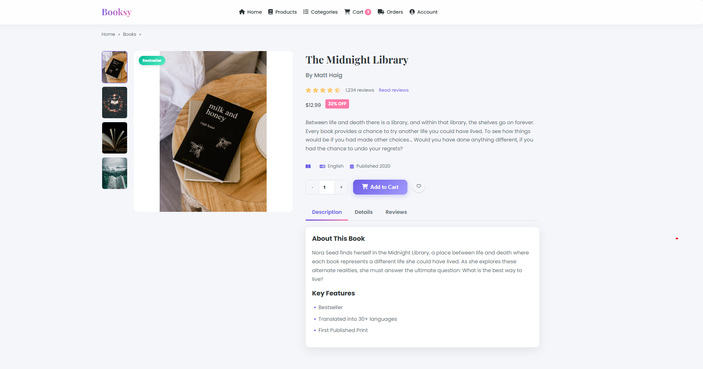

# Booksy - Java Web Application

This is a **Java web application** built using:

- Java (Servlets & Hibernate)
- HTML, CSS, JS
- MySQL database (via HeidiSQL)
- NetBeans IDE
- PayHere integration for payments

---

## 📂 Project Structure

- `src/` → Java source code (Servlets, Hibernate, PayHere integration)  
- `web/` → HTML, CSS, JS, JSP files and images  
- `database/booksy.sql` → SQL file to create database and tables  
- `screenshots/` → Website screenshots for reference  
- `hibernate.cfg.xml` → Hibernate config (replace placeholders with your DB credentials)  
- `PayHere.java` / `VerifyPayment.java` → Replace `MERCHANT_ID` and `MERCHANT_SECRET` with your credentials  

---

## 🛠️ Setup Instructions

### 1. Database

1. Open HeidiSQL or MySQL Workbench  
2. Import `database/booksy.sql` to create the database and tables  
3. Open `src/hibernate.cfg.xml` and update with your MySQL credentials:

```xml
<property name="hibernate.connection.username">your_db_username</property>
<property name="hibernate.connection.password">your_db_password</property>
```

---

## Website Images

### 📸 Screenshots


**Homepage**  
  

**Single Product View**  
  

**Signin**  
  

**Signup**  
  
**Account**  
  

**Add Book**  
  


**Cart**  
  

**Categories**  
  

**Checkout**  
  

**Filter**  
  

**Footer**  
  


**Verify**  
  


